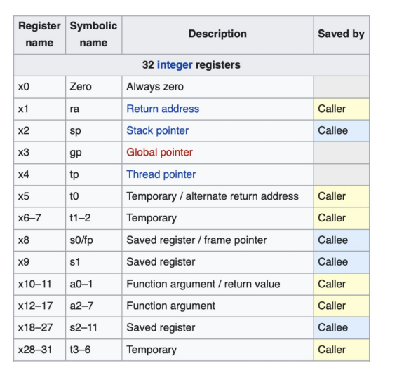

# ECE 391 Week 1 Pop Quiz


## Multiple Choice Questions

### Question 1
How many general purpose registers are there in riscv? 
- [ ] 8
- [ ] 16
- [ ] 24
- [ ] 32
- [ ] None of the above

<details>
<summary>Show Answer</summary>
<br>
RISCV has 32 General Purpose Registers. 


</details>

---

### Question 2
TEST TEST TEST TEST
- [ ] True
- [ ] False

<details>
<summary>Show Answer</summary>
<br>
**False** - Explanation 2
</details>


## Coding Questions

### Question 1
Write a program

** Try it on the IDE! **

```python


```

<details>
<summary>Show Answer</summary>
<br>
**False** - Explanation 2
</details>